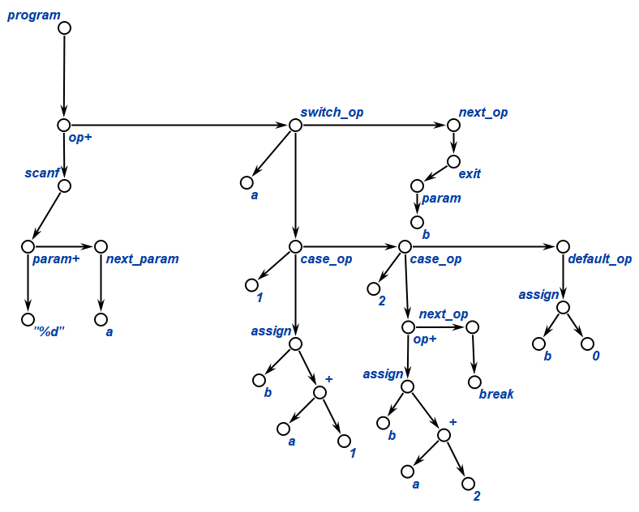

F4,C1 -> C3

F4:
```
int a, b;
scanf(“%d”, a);
switch(a) {
  case 1: b = a + 1;
  case 2: b = a + 2; break;
  default: b = 0;
}
exit(b);
```
C1
Синтаксическое дерево
C3
Трехадресный код. Четверки


- `program` – программа. Содержит список операторов программы.
- `op+` - список операторов программы. Содержит оператор и ссылку на следующий.
- `next_op` – ссылка на следующий оператор списка. Содержит оператор и ссылку на следующий (ссылка может отсутствовать).
- `assign` – оператор присваивания. Содержит объект, которому присваивается значение и значение, которое присваивается.
- `switch_op` - оператор множественного ветвления. Содержит объект для сравнения. Состоит из списка операторов тела switch. Содержит ссылку на следующий оператор.
- `case_op` - оператор тела switch. Состоит из сравниваемого значения и списка операторов тела case. Содержит ссылку на другой оператор case_op или default_op.
- `default_op` - Состоит из операторов тела default.
- `break` - прерывает выполнение следующих операторов тела switch
- `scanf` – оператор ввода. Содержит список параметров.
- `param` - список параметров функции. Содержит параметр.
- `param+` - список параметров функции. Содержит параметр и ссылку на следующий параметр.
- `next_param` - ссылка на следующий параметр функции. Содержит параметр функции и ссылку на следующий (ссылка может отсутствовать).

проанализируем бесполезный код
в данной ситуации оператор break стоит в case 2, но в case 1 его нет, значит в любой ситуации результат работы switch будет либо из case 2, либо default --- удалим case 1.
```
int a, b;
scanf(“%d”, a);
switch(a) {
  case 2: b = a + 2; break;
  default: b = 0;
}
exit(b);
```
проведем распространение копий
b используется только как значение в exit, значит заменим b на exit, break в таком случает не выполняется

```
int a;
scanf(“%d”, a);
switch(a) {
  case 2: exit(a + 2);
  default: exit(0);
}
```


**Ячейки памяти для констант**

| Номер ячейки | Значение |
| ------------ | -------- |
| D01          | “%d”     |


|      | op    | arg1  | arg2 | result |
| ---- | ----- | ----- | ---- | ------ |
| (0)  | param | D01   |      |        |
| (1)  | param | a     |      |        |
| (2)  | call  | scanf | 2    |        |
| (3)  | ==    | a     | 2    | $t_t$  |
| (4)  | if    | $t_1$ | (6)  |        |
| (5)  | goto  | (10)  |      |        |
| (6)  | +     | a     | 2    | $t_2$  |
| (7)  | param | $t_2$ |      |        |
| (8)  | call  | exit  | 1    |        |
| (9)  | goto  | (12)  |      |        |
| (10) | param | 0     |      |        |
| (11) | call  | exit  | 1    |        |
| (12) |       |       |      |        |

